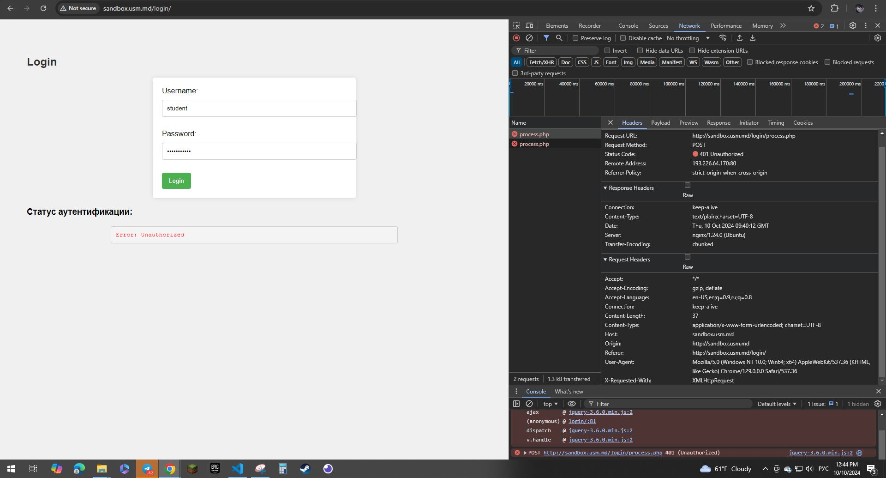
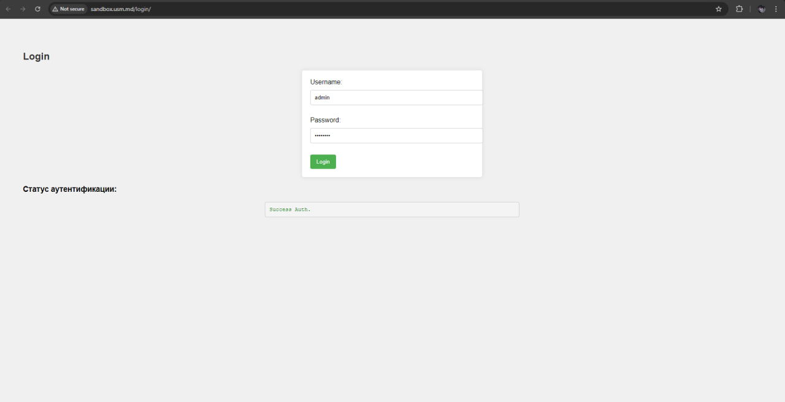
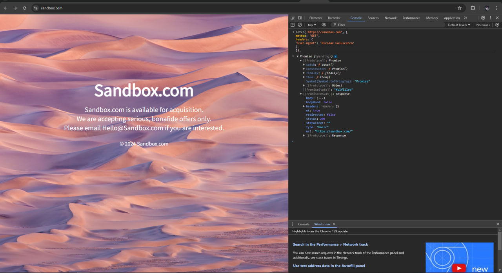

# Лабораторная работа №1. Основы HTTP

## Задание №1. Анализ HTTP-запросов

### 1. Вход на сайт с неверными данными

- **URL сайта**: [http://sandbox.usm.md/login](http://sandbox.usm.md/login)

- **Введенные данные**:
  - Username: `student`
  - Password: `studentpass`

### 2. Анализ запроса

- **URL запроса**: `http://sandbox.usm.md/login`
- **Метод запроса**: `POST`
- **Код состояния**: `401 Unauthorized`

### 3. Ответы на вопросы:
Какой метод HTTP был использован для отправки запроса?

Использован метод POST.
Какие заголовки были отправлены в запросе?

Content-Type: application/x-www-form-urlencoded
User-Agent: Имя Фамилия (замените на ваше имя и фамилию)
Host: sandbox.com
Какие параметры были отправлены в запросе?

make=Toyota
model=Corolla
year=2020
Какой код состояния был возвращен сервером?

401 Unauthorized

Какие заголовки были отправлены в ответе?

Accept: */*
Accept-Encoding: gzip, deflate
Accept-Language: en-US,en;q=0.9,ru;q=0.8
Connection: keep-alive
Content-Length: 37
Content-Type: application/x-www-form-urlencoded; charset=UTF-8
Host: sandbox.usm.md
Origin: http://sandbox.usm.md
Referer: http://sandbox.usm.md/login/
User-Agent: Mozilla/5.0 (Windows NT 10.0; Win64; x64) AppleWebKit/537.36 (KHTML, like Gecko) Chrome/129.0.0.0 Safari/537.36
X-Requested-With: XMLHttpRequest

## Задание №2. Составление HTTP-запросов*

### 1.GET-запрос
GET / HTTP/1.1
Host: sandbox.com
User-Agent: Nicolae Galuscenco

### 2.
POST /cars HTTP/1.1
Host: sandbox.com
Content-Type: application/x-www-form-urlencoded
User-Agent: Nicolae Galuscenco

make=Toyota&model=Corolla&year=2020

### 3.PUT-запрос 
PUT /cars/1 HTTP/1.1

Host: sandbox.com
Content-Type: application/json
User-Agent: Nicolae Galuscenco

{
  "make": "Toyota",
  "model": "Corolla",
  "year": 2021
}

### 4. POST-запрос
HTTP/1.1 200 OK
Content-Type: application/json
Content-Length: 47

{
  "status": "success",
  "data": {
    "make": "Toyota",
    "model": "Corolla",
    "year": 2020
  }
}

#### Предположения о возможных HTTP-кодах состояния
200 OK: Запрос успешно обработан, и данные о машине были обновлены. Используется для подтверждения успешного обновления данных.
201 Created: Запрос успешно выполнен, и в результате был создан новый ресурс (например, новая машина). Используется в ответ на POST-запрос, когда создается запись.
400 Bad Request: Сервер не может обработать запрос из-за некорректного запроса (например, ошибка в JSON-формате или отсутствуют необходимые поля).
401 Unauthorized: Запрос требует аутентификации, и пользователь не предоставил её или предоставленные учетные данные неверны.
403 Forbidden: У пользователя нет прав для выполнения запрошенного действия (например, попытка изменения данных, для которых не имеет прав).
404 Not Found: Указанный ресурс не найден, например, нет автомобиля с таким идентификатором, который требуется обновить.
500 Internal Server Error: Ошибка на стороне сервера, которая не позволила обработать запрос (например, проблемы с базой данных или ошибки в коде сервера).

